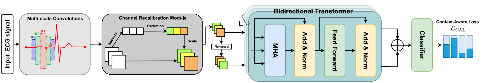

# ECGTransForm: Empowering Adaptive ECG Arrhythmia Classification Framework with Bidirectional Transformer [[Paper](https://www.sciencedirect.com/science/article/pii/S1746809423011473)] [[Cite](#citation)]
#### *by: Hany El-Ghaish, Emadeldeen Eldele*
#### This work is accepted for publication in the Biomedical Signal Processing and Control.

## About

Our proposed model, ECGTransForm, is a deep learning framework for ECG arrhythmia classification, featuring a novel Bidirectional Transformer mechanism and Multi-scale Convolutions for effective spatial and temporal feature extraction. The framework also includes a Context-Aware Loss to handle the class imbalance in ECG data, demonstrating superior performance in arrhythmia diagnosis.

## Dataset
We evaluate our model on the Chapman ECG dataset, which contains 10,646 ECG recordings from 10,646 patients, categorized into 11 classes of arrhythmias. The dataset is publicly
Lead II is available for download at [https://github.com/PTIT-ChauLH-Dataset/Chapman-Shaoxing/releases/download/Shaoxing_LeadII_only/lead.II.csv](https://github.com/PTIT-ChauLH-Dataset/Chapman-Shaoxing/releases/download/Shaoxing_LeadII_only/lead.II.csv)
and put into `data/chapman` folder